# Kiến Trúc Triển Khai Hệ Thống Trên Google Cloud Platform (GCP)

Tài liệu này mô tả chi tiết kiến trúc triển khai thực tế tối ưu hóa chi phí (Production-ready & Dev-optimized) cho hệ thống **SocialHub Microservices** trên hạ tầng đám mây **Google Cloud Platform (GCP)**.

---

## 🏗️ 1. Sơ Đồ Kiến Trúc Hệ Thống (Architecture Diagram)

```mermaid
flowchart TD
    subgraph Internet ["Internet Công Cộng"]
        Client["Trình duyệt / Mobile App"]
        GitHub["GitHub Repository"]
    end

    subgraph GCP ["Hạ tầng Google Cloud Platform (GCP)"]
        subgraph Security ["1. Cổng Kết Nối & Bảo Mật (VPC Edge)"]
            LB["Service LoadBalancer (API Gateway)"]
            WIF["Workload Identity Federation (WIF)"]
        end

        subgraph VPC ["2. Mạng VPC Nội Bộ (socialhub-vpc)"]
            subgraph GKE_Autopilot ["Google GKE Autopilot Cluster (Spot VM Node Pool)"]
                Gateway["api-gateway pod"]
                UserService["user-service pod"]
                FriendService["friend-service pod"]
                PostService["post-service pod"]
                MediaService["media-service pod"]
                NotificationService["notification-service pod"]
                ChatService["chat-service pod"]
                
                %% Các thành phần chạy nội bộ trong GKE để tiết kiệm chi phí
                RabbitMQ["RabbitMQ pod (Spot)"]
                RedisPod["Redis pod (Spot)"]
            end

            subgraph Database_Layer ["3. Lớp Dữ Liệu Ngoại Vi (Private Access Only)"]
                CloudSQL["Cloud SQL for PostgreSQL (Zonal Dev Mode)"]
                GCS["Google Cloud Storage (GCS Bucket)"]
                %% Memorystore["Memorystore for Redis (Tùy chọn cho Production)"]
            end
        end

        subgraph CloudBuildLayer ["4. Pipeline Tích Hợp (CI/CD)"]
            CloudBuild["Cloud Build Worker (E2_HIGHCPU_8)"]
            GAR["Artifact Registry (Docker Repo)"]
            DevConnect["Developer Connect (2nd gen)"]
        end
    end

    subgraph Partner_Cloud ["5. Cloud Đối Tác"]
        MongoAtlas["MongoDB Atlas on GCP"]
    end

    %% Luồng yêu cầu của Client
    Client -->|HTTP / WebSocket / 8080| LB
    LB --> Gateway

    %% Điều phối của API Gateway
    Gateway -->|Port 5000 / K8s DNS| UserService
    Gateway -->|Port 5000 / K8s DNS| FriendService
    Gateway -->|Port 5000 / K8s DNS| PostService
    Gateway -->|Port 5000 / K8s DNS| MediaService
    Gateway -->|Port 5000 / K8s DNS| NotificationService
    Gateway -->|Port 5000 / K8s DNS| ChatService

    %% Kết nối Database & Message Broker nội bộ
    UserService & FriendService & PostService & ChatService ===>|IP Private 10.128.0.2| CloudSQL
    PostService & ChatService & NotificationService & Gateway ===>|K8s DNS redis:6379| RedisPod
    NotificationService & ChatService ===>|K8s DNS rabbitmq:5672| RabbitMQ
    MediaService ===>|HTTPS API| GCS
    NotificationService & ChatService & MediaService ===>|Atlas URI| MongoAtlas

    %% Luồng CI/CD
    GitHub -->|1. Push Code / Trigger| DevConnect
    DevConnect --> CloudBuild
    CloudBuild -->|Build & Push| GAR
    CloudBuild -->|Deploy Manifests| GKE_Autopilot

    GitHub -->|2. Push Code / OIDC| WIF
    WIF -->|Impersonate Service Account| GAR
    WIF -->|Deploy Manifests| GKE_Autopilot
```

---

## 🛠️ 2. Chi Tiết Lựa Chọn Thành Phần & Công Nghệ

Hệ thống được thiết kế theo nguyên tắc **Tối ưu hóa chi phí môi trường phát triển (Dev) mà vẫn sẵn sàng chuyển đổi nhanh chóng lên Production (Prod-ready)**:

### A. Lớp Tính toán & Mở rộng (Compute)
*   **Google GKE Autopilot Cluster (Spot VM Node Pool)**:
    *   **Tối ưu chi phí (Spot VMs)**: Toàn bộ các Pod của ứng dụng được cấu hình gán nhãn `nodeSelector` và `tolerations` cho `gke-spot: "true"`. GKE Autopilot sẽ tự động lập lịch và chạy các Pod này trên các máy ảo chạy tài nguyên dư thừa (Spot VMs) của Google, giúp giảm **60-90% chi phí phần cứng**.
    *   **Tạm dừng (Scale-to-Zero)**: Khi kết thúc thời gian phát triển trong ngày hoặc không kiểm thử, có thể hạ số lượng Pod về `0` (ví dụ: `kubectl scale deployment --all --replicas=0`). GKE sẽ tự động giải phóng toàn bộ máy ảo và bạn sẽ không bị tính tiền phần cứng khi hệ thống không chạy.
*   **API Gateway Service (Type: LoadBalancer)**:
    *   Ứng dụng sử dụng một cổng LoadBalancer trực tiếp kết nối tới Gateway pod để giữ cấu trúc mạng đơn giản và tiết kiệm chi phí dịch vụ Load Balancer so với việc sử dụng Google Cloud HTTPS Application Load Balancer đắt đỏ khi dev.

### B. Lớp Dữ liệu & State (Databases & Messaging)
*   **Google Cloud SQL (PostgreSQL)**:
    *   Được cấu hình ở chế độ **Zonal (Đơn vùng)**, phiên bản PostgreSQL 16 và sử dụng máy ảo nhỏ nhất dành cho môi trường Dev (`db-custom-1-3840`).
    *   Hỗ trợ tính năng **Tạm dừng hoạt động (Stop Instance)** qua CLI thông qua chính sách hoạt động (`--activation-policy=NEVER`) khi không sử dụng giúp dừng phát sinh chi phí tính toán (chỉ tính phí lưu trữ ổ đĩa cứng cực thấp).
*   **Redis Pod (Chạy trực tiếp trong GKE)**:
    *   Thay vì sử dụng Google Cloud Memorystore for Redis (dịch vụ có giá thuê khá đắt đỏ, từ $15-30/tháng và không có tính năng tạm dừng), hệ thống triển khai một Pod Redis riêng chạy trực tiếp trong cụm GKE ([k8s/redis.yaml](file:///d:/Hoc_tap_Project_complete/SocialHub_Microservices/k8s/redis.yaml)).
    *   Redis Pod được gán chạy trên Spot VM, giúp bạn có môi trường Cache & Blacklist JWT hoàn toàn miễn phí.
*   **RabbitMQ Pod (Chạy trực tiếp trong GKE)**:
    *   Hàng đợi tin nhắn được triển khai qua tệp [k8s/rabbitmq.yaml](file:///d:/Hoc_tap_Project_complete/SocialHub_Microservices/k8s/rabbitmq.yaml) bên trong cụm GKE, giúp giải quyết việc trao đổi sự kiện realtime cho `notification-service` và `chat-service` mà không cần thuê máy chủ hoặc cài đặt phức tạp.
*   **Google Cloud Storage (GCS)**:
    *   Sử dụng GCS Bucket ở dạng Single-Region (`asia-east1`) thay thế cho dịch vụ MinIO tự chạy. GCS cung cấp khả năng tương thích cao với S3 XML API để `media-service` xử lý tải ảnh/video dễ dàng.
*   **MongoDB Atlas (GCP Partner Integration)**:
    *   Dịch vụ MongoDB được triển khai trên nền tảng đám mây của Atlas tích hợp sẵn trên hạ tầng Google Cloud, sử dụng gói Free Tier (M0) giúp tối ưu hóa chi phí cho dự án phát triển.

---

## 🤖 3. Quy Trình Tự Động Hóa CI/CD

SocialHub hỗ trợ hai phương án tích hợp và triển khai liên tục (CI/CD) bảo mật, độc lập và linh hoạt:

### 🟢 Cách 1: Google Cloud Build (Tích hợp All-in-GCP)
*   **Kết nối bảo mật (Developer Connect - 2nd gen)**: Sử dụng kết nối bảo mật thế hệ mới của Google để liên kết tài khoản GitHub mà không cần lưu trữ key.
*   **Máy ảo cấu hình cao (High-CPU Build Worker)**: Khi có sự kiện push code lên nhánh `main`, Cloud Build sẽ khởi tạo máy ảo cấu hình mạnh `E2_HIGHCPU_8` tại vùng `asia-east1`. Máy ảo này hỗ trợ build Docker song song cho **7 microservices đồng thời**, giúp giảm thời gian build từ 15-20 phút xuống chỉ còn **dưới 3 phút**.
*   **Tích hợp an toàn**: Toàn bộ luồng kéo code, build Docker, push vào **Artifact Registry (GAR)** và triển khai lên **GKE** diễn ra khép kín trong hạ tầng Google Cloud.

### 🔵 Cách 2: GitHub Actions (Tích hợp qua WIF)
*   **Workload Identity Federation (WIF)**: Cơ chế xác thực không dùng khóa (Keyless). GitHub Actions sẽ tự động đổi Identity Token của GitHub lấy mã truy cập ngắn hạn (OAuth token) của GCP từ WIF. Điều này giúp loại bỏ hoàn toàn rủi ro bị lộ file khóa JSON (Service Account Key) trên mạng Internet.
*   **Parallel Runner**: Tận dụng 7 máy ảo miễn phí chạy song song của GitHub Actions để chạy build song song cho từng service.
*   **Dedicated Service Account (`socialhub-build-sa`)**: Sử dụng tài khoản dịch vụ do người dùng quản lý riêng, được phân quyền tối thiểu (Least Privilege) chỉ gồm ghi log, đẩy ảnh lên GAR và ra lệnh deploy lên cụm GKE, tăng mức độ an toàn thông tin cho toàn hệ thống.

---

## 🔒 4. Cơ Chế Bảo Mật Mạng (VPC Isolation)

*   **VPC Private Subnet Only**: Cụm GKE Autopilot và Database Cloud SQL kết nối với nhau thông qua cơ chế **Private Service Access** trên dải mạng nội bộ `socialhub-vpc`. Không có bất kỳ thành phần database nào mở cổng kết nối ra ngoài Internet công cộng.
*   **Định tuyến nội bộ qua DNS**: Các microservice giao tiếp với nhau bằng tên miền nội bộ của Kubernetes (ví dụ: `http://user-service:5000`) thông qua dịch vụ Kube-DNS của cụm.
*   **Cloud NAT**: Các Pod trong GKE không có IP Public nhưng vẫn có thể tải thư viện ngoài (như `npm install` hoặc kết nối MongoDB Atlas) nhờ thiết lập cổng dịch vụ **Cloud NAT** và **Cloud Router** để chuyển dịch địa chỉ nguồn an toàn.
