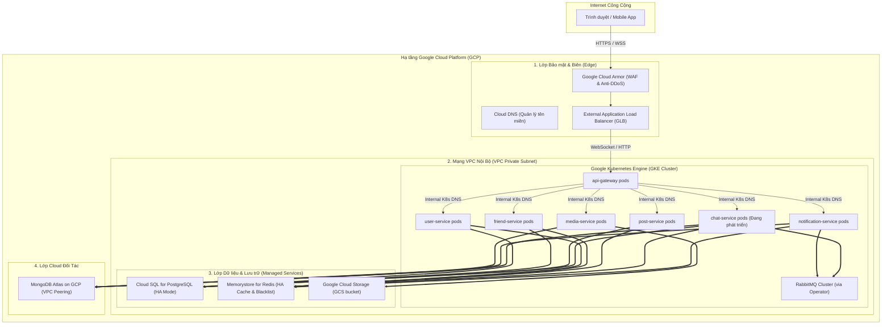

# Kiến Trúc Triển Khai Hệ Thống Trên Google Cloud Platform (GCP)

Tài liệu này mô tả chi tiết kiến trúc triển khai thực tế (Production-ready) cấp doanh nghiệp cho hệ thống **SocialHub Microservices** trên hạ tầng đám mây **Google Cloud Platform (GCP)**.

---

## 🏗️ 1. Sơ Đồ Kiến Trúc Hệ Thống (Architecture Diagram)



---

## 🛠️ 2. Chi Tiết Lựa Chọn Thành Phần & Công Nghệ

Hệ thống được thiết kế để chịu tải lớn, sẵn sàng tự động phục hồi khi gặp sự cố mà không cần can thiệp thủ công:

### A. Lớp Tính toán & Mở rộng (Compute)
*   **Google Kubernetes Engine (GKE) Autopilot**:
    *   **Tại sao dùng?**: GKE Autopilot tự động quản lý hạ tầng (Node provisioning), tự động cấu hình bảo mật chuẩn GCP, tối ưu chi phí (chỉ tính tiền trên tài nguyên thực tế pod sử dụng).
    *   **Khả năng co giãn (Auto-scaling)**: Sử dụng **Horizontal Pod Autoscaler (HPA)** để tự động tăng số lượng pods của từng service (ví dụ: nhân bản `post-service` lên 10 pods) khi lượng request hoặc CPU tăng đột biến, sau đó tự động giảm khi hết tải.
    *   **Private VPC Isolation**: Toàn bộ pods chạy trong dải IP private không lộ ra ngoài internet, tránh bị tấn công trực tiếp.

### B. Lớp Dữ liệu & State (Managed Databases)
*   **Google Cloud SQL (PostgreSQL)**:
    *   Cấu hình ở chế độ **High Availability (HA)**: Một database chính (Master) ở Zone A và một database phụ (Standby) ở Zone B đồng bộ dữ liệu thời gian thực. Nếu Zone A gặp thảm họa, GCP tự động chuyển hướng kết nối sang Zone B trong vài giây (Zero data loss).
*   **Google Cloud Memorystore (Redis)**:
    *   Làm nơi lưu trữ cache mạng lưới bạn bè và **Blacklist JWT Token** từ `gateway`.
    *   Cấu hình HA đa vùng giúp tăng tốc độ đọc dữ liệu lên tới hàng trăm ngàn requests/giây với độ trễ < 1ms.
*   **Google Cloud Storage (GCS)**:
    *   Thay thế hoàn toàn MinIO để lưu trữ ảnh, video tải lên từ `media-service`.
    *   Tích hợp sẵn tính năng tự động sao lưu địa lý (Multi-regional replication) và bảo mật IAM cao cấp.
*   **MongoDB Atlas (GCP Partner integration)**:
    *   Cơ sở dữ liệu NoSQL lưu thông báo và bài viết, được thiết lập VPC Peering trực tiếp với mạng VPC của GKE để bảo mật hoàn toàn và có độ trễ cực thấp.

### C. Lớp Mạng & An Ninh (Security & Edge)
*   **External Application Load Balancer (GLB)**:
    *   Hỗ trợ SSL Offloading (quản lý chứng chỉ HTTPS tại Load Balancer, giải phóng tài nguyên mã hóa cho ứng dụng phía sau).
    *   Hỗ trợ chuyển tiếp WebSocket streams nguyên bản cho `notification-service` và `chat-service`.
*   **Google Cloud Armor**:
    *   Bộ lọc tường lửa ứng dụng web (WAF) ngăn chặn tấn công Top 10 OWASP (SQL Injection, XSS) và chống tấn công từ chối dịch vụ (DDoS) quy mô lớn.

---

## 🌐 3. Chiến Lược Quản Lý Tên Miền & SSL (Khi Chưa Có Domain)

Do hệ thống hiện tại **chưa có tên miền riêng**, chúng ta sẽ áp dụng chiến lược chuyển tiếp cấu hình linh hoạt:

1.  **Giai đoạn Thử nghiệm & Phát triển (Không tốn chi phí)**:
    *   Sau khi tạo **External Application Load Balancer**, Google Cloud sẽ cấp cho bạn một **IP Public tĩnh** (ví dụ: `35.244.12.34`).
    *   **Cấu hình DNS giả lập (Local DNS Mapping)**: 
        Người dùng/Developer chỉ cần trỏ IP tĩnh này vào file `/etc/hosts` (hoặc `C:\Windows\System32\drivers\etc\hosts` trên Windows) để mô phỏng tên miền thật:
        ```text
        35.244.12.34  socialhub.com
        35.244.12.34  api.socialhub.com
        ```
        Lúc này, bạn có thể truy cập `http://socialhub.com` từ trình duyệt của mình như một trang web thực sự mà không cần mua tên miền.
2.  **Giai đoạn Production (Có tên miền thật)**:
    *   Mua tên miền trên Google Domains, Namecheap, Cloudflare...
    *   Trỏ bản ghi tên miền (A Record) về IP tĩnh của Load Balancer.
    *   Sử dụng **Google Certificate Manager** để tự động tạo, gia hạn chứng chỉ SSL bảo mật HTTPS (`https://`) miễn phí của Let's Encrypt.

---

## 💬 4. Giải Pháp Co Giãn WebSocket Cho Dịch Vụ Realtime (Notification & Chat)

Khi hệ thống triển khai trên GKE, các dịch vụ truyền tải dữ liệu thời gian thực như `notification-service` và `chat-service` (đang phát triển) sẽ chạy nhiều replica (nhiều pod đồng thời). 

### Vấn đề:
Nếu User A kết nối Socket.IO tới Pod 1, còn User B kết nối tới Pod 2: khi User A gửi tin nhắn cho User B, Pod 1 sẽ không tìm thấy kết nối của User B để đẩy tin nhắn thời gian thực.

### Giải pháp:
1.  **Redis Adapter (`@socket.io/redis-adapter`)**:
    *   Tất cả các pod `notification-service` và `chat-service` được cấu hình kết nối chung tới cụm **Redis Memorystore**.
    *   Khi có sự kiện đẩy thông tin, adapter sẽ pub sự kiện qua Redis Pub/Sub đến toàn bộ các pod khác. Pod chứa socket của User B sẽ nhận được và đẩy dữ liệu xuống client.
2.  **Session Affinity (Sticky Sessions)**:
    *   Cấu hình Load Balancer sử dụng cookie hoặc client IP affinity để giữ client kết nối cố định vào một pod duy nhất trong suốt phiên làm việc, tránh việc bắt tay WebSocket bị đứt đoạn hoặc chuyển pod liên tục.

---

## 🤖 5. Quy Trình Tự Động Hóa CI/CD (Google Cloud Build & Cloud Deploy)

Hệ thống CI/CD được xây dựng bằng công cụ chính hãng của Google Cloud để đảm bảo tốc độ và sự bảo mật tối đa:

```
[Mã nguồn GitHub]
      │ (git push / Merge PR)
      ▼
[Google Cloud Build] ──> (Build & Push Docker) ──> [Google Artifact Registry]
      │
      ▼
[Google Cloud Deploy] ──> (Pipeline Release) ──> [GKE Autopilot (Deploy Pods)]
```

*   **Google Cloud Build**: Tự động lắng nghe sự kiện push code từ GitHub, build Docker Image bằng file Dockerfile tối ưu của từng service, gắn nhãn phiên bản (tag) và đẩy vào **Artifact Registry (GAR)**.
*   **Google Cloud Deploy**: Quản lý vòng đời release sản phẩm. Nó sẽ lấy manifest của GKE, tự động thay thế Image Tag mới nhất, chạy thử nghiệm môi trường Staging/Dev, yêu cầu phê duyệt (Approvals) trước khi đẩy bản cập nhật chính thức lên cụm GKE Production mà không gây mất kết nối (Zero Downtime).
